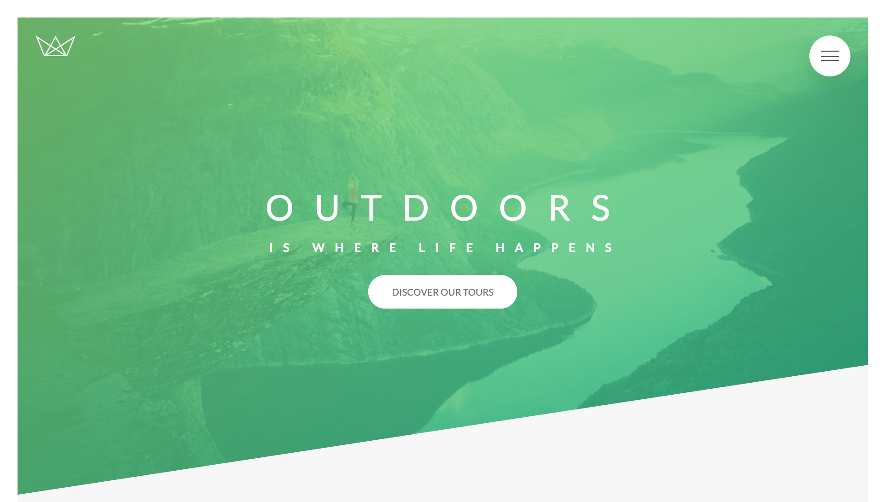

# 🌿 Natours | Exciting Tours for Adventurous People

This is a project I built during an advanced CSS course. It simulates a website for a fictional nature tour agency.

## 📑 Table of contents

-   [Overview](#overview)
    -   [Screenshot](#screenshot)
    -   [Links](#links)
-   [My process](#my-process)
    -   [Built with](#built-with)
    -   [What I learned](#what-i-learned)
    -   [Continued development](#continued-development)
    -   [Useful resources](#useful-resources)
-   [Author](#author)
-   [Acknowledgments](#acknowledgments)

## 🔍 Overview

### 📸 Screenshot



### 🔗 Links

-   Solution URL: [https://github.com/Jair-MV/Natours](https://github.com/jmv-dev/Natours)
-   Live Site URL: [https://natours-jmv-mx.netlify.app](https://natours-jmv-mx.netlify.app)

## 🛠️ My process

### Built with

-   Semantic HTML5 markup
-   [SASS](https://sass-lang.com/) - CSS preprocessor
-   SASS variables & CSS custom properties
-   Flexbox
-   CSS Grid
-   Desktop-first workflow

### 📘 What I learned

This project taught me a wide variety of things. One of the most important takeaways was **architecture**.

In my previous project (Omnifood), I learned how to plan a website, with a strong focus on design. I followed a methodology to carefully choose the “design ingredients” (borders, colors, fonts, icons, etc.). In _Natours_, I expanded that foundation by implementing the [7-1 architecture pattern](https://sass-guidelin.es/es/#el-patron-7-1). I found it incredibly useful for keeping my code organized and easy to navigate.

Thanks to SASS, I was able to work with responsive design in a much more practical way, using a technique from the course called the **Media Query Manager**:

```scss
@mixin respond($breakpoint) {
    @if $breakpoint == phone {
        @media only screen and (max-width: 37.5em) {
            @content;
        }
    }

    @if $breakpoint == tab-port {
        @media only screen and (max-width: 56.25em) {
            @content;
        }
    }

    @if $breakpoint == tab-land {
        @media only screen and (max-width: 75em) {
            @content;
        }
    }

    @if $breakpoint == big-desktop {
        @media only screen and (min-width: 112.5em) {
            @content;
        }
    }
}
```

Using it was simple — just apply it where needed:

```scss
@include mixins.respond(big-desktop) {
    font-size: 80%;
}
```

Two things I want to highlight from this project:

1. The course is slightly outdated in terms of layout methods — it used floats to build a column system. I decided to modernize it by applying **Flexbox** and **CSS Grid**, which I had learned in my previous project.

2. I’m especially proud of how I handled the **hero section**, with a diagonal line running from the bottom left to the opposite corner. Unlike the original approach, which adjusted this manually at various screen sizes, I wanted it to adapt **automatically**, without hardcoded breakpoints. It was a challenge that helped me understand the limits of SASS variables and the power of **CSS custom properties**.

> To put it metaphorically: SASS variables are like Charon — they get you to your destination. But CSS custom properties are companions for the whole journey. 🚀

This automation extended to other “cut” sections of the site, using tools like calc() and tan(). The full explanation is a bit long, but if you're curious, feel free to dive into the code!

Sure, I could’ve just given all sections the same background color… but where’s the fun in that? 😄

I also explored:

-   Animations
-   CSS-only tricks to add interactivity without JavaScript
-   New CSS at-rules I hadn’t used before
-   Creating a build process to compile SASS, concatenate files, add prefixes, and minify the output

### 🚀 Continued development

I want to go deeper into SASS and the 7-1 architecture — I believe they offer a lot for medium to large-scale projects.

Additionally, I’d like to explore:

-   How CSS processes values (I ran into some issues with calculations that I suspect are due to this)
-   Trigonometric functions in CSS and their creative potential
-   Responsive images and how to select them wisely based on screen size and pixel density

### 📚 Useful resources

-   [MDN Web Docs](https://developer.mozilla.org/) – A go-to reference for documentation, examples, and best practices.

## 👤 Author

-   GitHub - [Jair-MV](https://github.com/Jair-MV)

## 🙌 Acknowledgments

This project was built as part of the **"Advanced CSS and Sass: Flexbox, Grid, Animations and More!"** course by [Jonas Schmedtmann](https://www.udemy.com/user/jonasschmedtmann/) on Udemy.  
A big thanks to Jonas for providing such a well-structured and hands-on learning experience!
