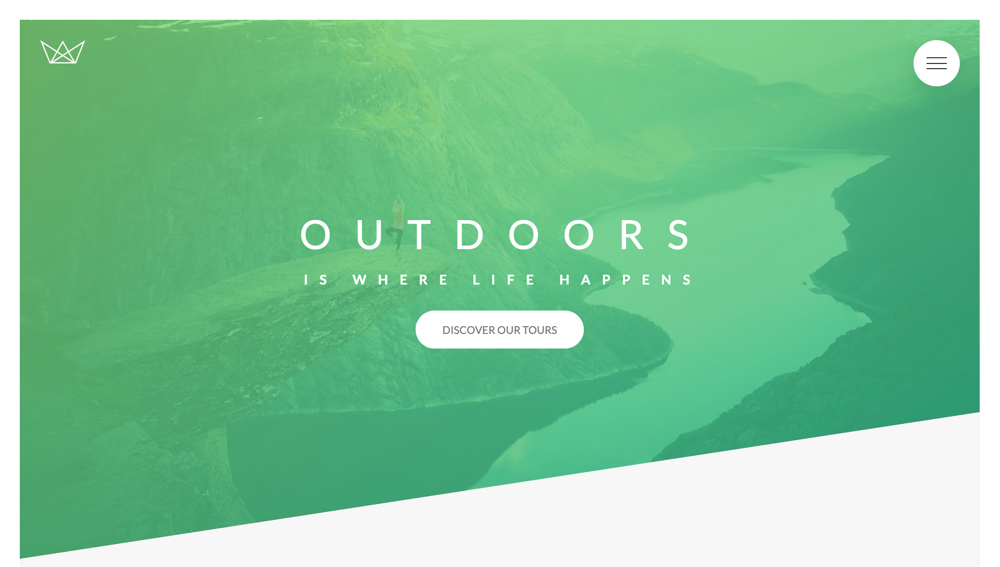

# Advanced CSS and Sass - Project

This is the final project of the course [Advanced CSS and Sass](https://www.udemy.com/course/advanced-css-and-sass/).

## Table of contents

-   [Overview](#overview)
    -   [Screenshot](#screenshot)
    -   [Links](#links)
-   [My process](#my-process)
    -   [Built with](#built-with)
    -   [What I learned](#what-i-learned)
    -   [Continued development](#continued-development)
-   [Author](#author)

## Overview

### Screenshot



### Links

-   Solution URL: [https://github.com/Jair-MV/Natours](https://github.com/Jair-MV/Natours)
-   Live Site URL: [https://natours-jmv.netlify.app/](https://natours-jmv.netlify.app/)

## My process

### Built with

-   Semantic HTML5 markup
-   CSS custom properties
-   Flexbox
-   CSS Grid
-   Desktop-first workflow
-   CSS animations
-   [BEM](https://getbem.com/) - A css methodology
-   [SASS](https://sass-lang.com/)

### What I learned

Besides learning new css properties, what i think was the most valuable was SASS to have a maintainable and scalable code. This tool make the code more easy to read and combined with the BEM methodology to write classes names more easy to add new code.

I also learned about animations, i liked to make the navigation menu wtih that green background expanding across the entire screen.

To conclude, the media query manager (code below) used in the project and made possible by SASS is an amazing livesaver to make responsive design.

```css
@mixin respond($breakpoint) {
    @if $breakpoint == big-desktop {
        // 1800px
        @media (min-width: 112.5em) {
            @content;
        }
    }

    @if $breakpoint == tab-land {
        // 1200px
        @media (max-width: 75em) {
            @content;
        }
    }

    @if $breakpoint == tab-port {
        // 900px
        @media (max-width: 56.25em) {
            @content;
        }
    }

    @if $breakpoint == phone {
        // 600px
        @media (max-width: 37.5em) {
            @content;
        }
    }
}
```

### Continued development

At this point i have made two course projects and i feel confident to start making my own projects.

## Author

-   GitHub - [JairMV](https://github.com/Jair-MV)
